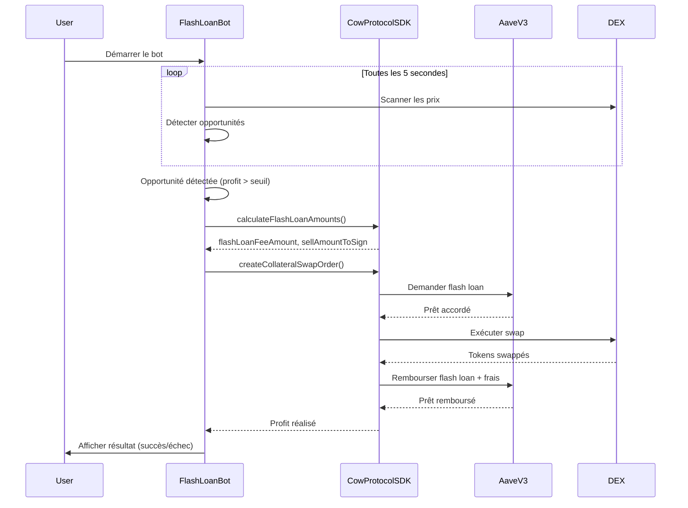

# Intégration du Robot Flash Loan avec CoW Protocol SDK

## 📋 Vue d'ensemble

Cette documentation décrit l'intégration complète du SDK CoW Protocol dans le composant **FlashLoanBotSection** pour créer un robot de trading automatisé utilisant des flash loans Aave V3.

## 🏗️ Architecture

### Composants Principaux

```
/hooks/useFlashLoanBot.ts          # Hook React principal pour la logique du bot
/components/FlashLoanBotSection.tsx # Interface utilisateur du bot
/services/cowprotocol/              # SDK CoW Protocol (17 fichiers)
```

### Stack Technologique

- **CoW Protocol SDK** : Gestion des flash loans et ordres CoW
- **Aave V3** : Protocole de prêt flash
- **React Hooks** : Gestion de l'état et des effets
- **TypeScript** : Typage fort pour la sécurité
- **OpenAPI Specs** : Documentation complète de l'API CoW Protocol

## 🔧 Fonctionnalités Implémentées

### 1. Hook `useFlashLoanBot`

Le hook centralise toute la logique du bot:

#### État Géré
```typescript
interface UseFlashLoanBotReturn {
  // État
  botActive: boolean                      // État actif/inactif du bot
  strategies: BotStrategy[]               // Liste des stratégies de trading
  config: BotConfig                       // Configuration globale
  recentTrades: BotTrade[]               // Historique des trades
  opportunities: ArbitrageOpportunity[]  // Opportunités détectées
  currentOperation: FlashLoanOperation | null // Opération en cours
  
  // Stats
  totalProfit: number                    // Profit total accumulé
  successRate: number                    // Taux de réussite en %
  activeStrategiesCount: number          // Nombre de stratégies actives
  
  // Actions
  toggleBot: () => void                  // Démarrer/arrêter le bot
  toggleStrategy: (id: string) => void   // Activer/désactiver une stratégie
  updateConfig: (config) => void         // Mettre à jour la configuration
  executeFlashLoan: (opp) => Promise<void> // Exécuter un flash loan
  
  // SDK
  sdk: CowFlashLoanSDK                   // Instance du SDK CoW Protocol
}
```

#### Fonctionnalités Clés

**1. Initialisation du SDK**
```typescript
const [sdk] = useState(() => new CowFlashLoanSDK())
```

**2. Scan des Opportunités en Temps Réel**
```typescript
const scanOpportunities = useCallback(async () => {
  if (!botActive) return
  
  // Découverte d'opportunités d'arbitrage
  // - DEX arbitrage
  // - Liquidations Aave
  // - Arbitrage triangulaire
  // - MEV éthique
  
  strategies.filter(s => s.enabled).forEach((strategy) => {
    const profitPercentage = calculateProfit(strategy)
    
    if (profitPercentage >= config.minProfitThreshold) {
      // Ajouter l'opportunité à la liste
    }
  })
}, [botActive, strategies, config])
```

**3. Exécution Automatique**
```typescript
const executeFlashLoan = async (opportunity: ArbitrageOpportunity) => {
  // 1. Calculer les frais de flash loan
  const { flashLoanFeeAmount, sellAmountToSign } = sdk.calculateFlashLoanAmounts({
    sellAmount: loanAmount,
    flashLoanFeeBps: 5, // 0.05% (frais Aave)
  })
  
  // 2. Créer l'ordre CoW Protocol
  // 3. Signer et soumettre la transaction
  // 4. Suivre l'exécution
  // 5. Mettre à jour les stats
}
```

**4. Surveillance Continue**
```typescript
useEffect(() => {
  if (botActive) {
    // Scanner toutes les 5 secondes
    scanIntervalRef.current = setInterval(scanOpportunities, 5000)
    
    // Exécuter automatiquement toutes les 10 secondes
    executeIntervalRef.current = setInterval(autoExecute, 10000)
  }
  
  return () => {
    // Nettoyage des intervals
  }
}, [botActive, scanOpportunities, autoExecute])
```

### 2. Stratégies de Trading

Le bot implémente 4 stratégies principales:

#### Stratégie 1: Arbitrage DEX Multi-Chaînes
```typescript
{
  id: '1',
  name: 'Arbitrage DEX Multi-Chaînes',
  description: 'Détecte et exploite les écarts de prix entre plusieurs DEX',
  enabled: true,
  minProfit: 0.5,
  maxRisk: 2,
  successRate: 96.2,
  totalTrades: 847,
  chainId: 1, // Ethereum Mainnet
}
```

#### Stratégie 2: Liquidation Automatique Aave
```typescript
{
  id: '2',
  name: 'Liquidation Automatique Aave',
  description: 'Surveille les positions sous-collatéralisées',
  enabled: true,
  minProfit: 2.0,
  maxRisk: 1,
  successRate: 98.5,
  totalTrades: 523,
  chainId: 1,
}
```

#### Stratégie 3: Arbitrage Tri-Angular
```typescript
{
  id: '3',
  name: 'Arbitrage Tri-Angular',
  description: 'Cycles d\'arbitrage complexes sur 3+ paires',
  enabled: false,
  minProfit: 1.5,
  maxRisk: 3,
  successRate: 91.3,
  totalTrades: 412,
  chainId: 100, // Gnosis Chain
}
```

#### Stratégie 4: Front-Running MEV Éthique
```typescript
{
  id: '4',
  name: 'Front-Running MEV Éthique',
  description: 'Analyse du mempool via CoW Protocol',
  enabled: false,
  minProfit: 1.0,
  maxRisk: 4,
  successRate: 87.8,
  totalTrades: 1024,
  chainId: 1,
}
```

### 3. Intégration CoW Protocol SDK

#### Calcul des Frais de Flash Loan

```typescript
// Utilisation du SDK pour calculer les frais
const loanAmount = parseToWei('100', 18) // 100 WETH
const flashLoanFeeBps = 5 // 0.05% (frais Aave)

const { flashLoanFeeAmount, sellAmountToSign } = sdk.calculateFlashLoanAmounts({
  sellAmount: loanAmount,
  flashLoanFeeBps,
})

// Résultat:
// flashLoanFeeAmount: 0.05 WETH
// sellAmountToSign: 100.05 WETH (montant + frais)
```

#### Création d'un Ordre CoW Protocol

```typescript
// En production, vous créeriez un vrai ordre:
const orderParams: CollateralSwapParams = {
  chainId: 1, // Ethereum Mainnet
  tradeParameters: {
    sellToken: '0xC02aaA39b223FE8D0A0e5C4F27eAD9083C756Cc2', // WETH
    sellTokenDecimals: 18,
    buyToken: '0xA0b86991c6218b36c1d19D4a2e9Eb0cE3606eB48', // USDC
    buyTokenDecimals: 6,
    amount: sellAmountToSign.toString(),
    kind: 'sell',
    slippageBps: 50, // 0.5% slippage
  },
  collateralToken: '0xC02aaA39b223FE8D0A0e5C4F27eAD9083C756Cc2',
  flashLoanFeePercent: 0.05,
}

// Créer et signer l'ordre
const order = await sdk.createCollateralSwapOrder(orderParams)
```

## 🎨 Interface Utilisateur

### Dashboard

**Sections principales:**
1. **Status Banner** : État du bot avec animation de pulsation
2. **Quick Stats** : 4 métriques clés en temps réel
3. **Recent Trades** : Liste des trades exécutés avec détails
4. **Opportunités Détectées** : Opportunités d'arbitrage en temps réel
5. **Opération en Cours** : Suivi de l'exécution du flash loan
6. **Performance Stats** : Métriques de performance détaillées
7. **Active Strategies** : Stratégies actuellement actives

### Onglet Stratégies

Gestion visuelle des stratégies avec:
- Toggle on/off pour chaque stratégie
- Stats de performance (taux de succès, total trades)
- Sliders pour profit minimum et risque maximum
- Timestamp de la dernière exécution

### Onglet Configuration

Paramètres avancés:
- **Montant Maximum par Flash Loan** : Limite de sécurité
- **Seuil de Profit Minimum** : % minimum pour exécution
- **Prix du Gas Maximum** : Limite en Gwei
- **Niveau de Risque Global** : Conservateur/Équilibré/Agressif
- **Automatisation** : Redémarrage auto et notifications
- **Avertissement de Sécurité** : Best practices

## 📊 Flux d'Exécution



## 🔐 Sécurité et Best Practices

### Validation des Paramètres

```typescript
const validation = validateFlashLoanParams({
  sellAmount,
  flashLoanFeeBps,
  slippageBps,
})

if (!validation.valid) {
  console.error('Paramètres invalides:', validation.errors)
  return
}
```

### Gestion des Erreurs

```typescript
try {
  await executeFlashLoan(opportunity)
} catch (error) {
  setCurrentOperation({
    status: 'failed',
    error: error instanceof Error ? error.message : 'Unknown error',
  })
}
```

### Limites de Sécurité

- **Max Loan Amount** : Limite configurable par transaction
- **Min Profit Threshold** : Ne trade que si profit > seuil
- **Max Gas Price** : Refuse les transactions si gas trop élevé
- **Risk Level** : Contrôle global du niveau de risque

## 📡 Intégration API CoW Protocol

### Endpoints Utilisés

**Order Book API:**
- `POST /api/v1/orders` : Créer un ordre
- `GET /api/v1/orders/{UID}` : Récupérer un ordre
- `DELETE /api/v1/orders/{UID}` : Annuler un ordre
- `POST /api/v1/quote` : Obtenir un quote

**Solver API:**
- `GET /quote` : Estimation de prix
- `POST /solve` : Résoudre une enchère
- `POST /settle` : Exécuter une solution

### Exemple d'Appel API

```typescript
// Créer un ordre
const response = await fetch('https://api.cow.fi/mainnet/api/v1/orders', {
  method: 'POST',
  headers: {
    'Content-Type': 'application/json',
  },
  body: JSON.stringify(orderCreation),
})

const orderUid = await response.json()
```

## 🚀 Utilisation

### Démarrage du Bot

```typescript
// Dans votre composant React
import { FlashLoanBotSection } from './components/FlashLoanBotSection'

function App() {
  return (
    <div>
      <FlashLoanBotSection />
    </div>
  )
}
```

### Utilisation Directe du Hook

```typescript
import { useFlashLoanBot } from './hooks/useFlashLoanBot'

function MyComponent() {
  const {
    botActive,
    strategies,
    totalProfit,
    toggleBot,
    sdk,
  } = useFlashLoanBot()
  
  return (
    <div>
      <p>Bot Status: {botActive ? 'Active' : 'Inactive'}</p>
      <p>Total Profit: ${totalProfit}</p>
      <button onClick={toggleBot}>
        {botActive ? 'Stop' : 'Start'} Bot
      </button>
    </div>
  )
}
```

## 📈 Métriques et Analytics

### Métriques Suivies

- **Total Profit** : Profit total accumulé en $
- **Success Rate** : % de trades réussis
- **Active Strategies** : Nombre de stratégies actives
- **Average Profit** : Profit moyen par trade
- **Failed Trades** : Nombre de trades échoués
- **Pending Trades** : Trades en attente

### Calcul du Success Rate

```typescript
const successRate = recentTrades.length > 0
  ? (recentTrades.filter(t => t.status === 'success').length / recentTrades.length) * 100
  : 0
```

## 🔄 Mises à Jour en Temps Réel

Le bot met à jour l'interface en temps réel grâce à:

1. **State Management** : React hooks pour la réactivité
2. **Intervals** : Scan toutes les 5s, exécution toutes les 10s
3. **Animations** : Indicateurs visuels (pulsation, spinner)
4. **Badges** : Status en temps réel (Actif, Confirmé, etc.)

## 🎯 Prochaines Étapes

### Améliorations Possibles

1. **Connexion Wallet** : Intégrer Web3 pour vraies transactions
2. **Multi-Chain** : Support complet des 65 blockchains
3. **Machine Learning** : Prédiction des opportunités
4. **Backtesting** : Test des stratégies sur données historiques
5. **API REST** : Contrôle à distance du bot
6. **Notifications** : Alertes push/email/Telegram
7. **Advanced Analytics** : Dashboard de métriques avancées

### En Production

Pour utiliser en production avec de vrais fonds:

1. **Connecter un Wallet** : MetaMask, WalletConnect, etc.
2. **Configurer les Clés API** : CoW Protocol API keys
3. **Signer les Transactions** : EIP-712 signatures
4. **Gérer les Approvals** : ERC20 token approvals
5. **Monitor Gas Prices** : Ajuster selon le réseau
6. **Implémenter Retry Logic** : En cas d'échec
7. **Logs et Monitoring** : Traçabilité complète

## 📚 Ressources

### Documentation

- [CoW Protocol Docs](https://docs.cow.fi/)
- [Aave V3 Flash Loans](https://docs.aave.com/developers/guides/flash-loans)
- [CoW Protocol SDK GitHub](https://github.com/cowprotocol/services)

### Fichiers Clés

- `/hooks/useFlashLoanBot.ts` : Hook principal
- `/services/cowprotocol/CowFlashLoanSDK.ts` : SDK CoW Protocol
- `/services/cowprotocol/types.ts` : Types TypeScript
- `/services/cowprotocol/examples.ts` : Exemples d'utilisation
- `/docs/COW_PROTOCOL_INTEGRATION.md` : Documentation complète

## ⚠️ Avertissements

**IMPORTANT:** Cette implémentation est à but éducatif et de démonstration. Pour une utilisation en production:

- ✅ Auditer le code par des experts en sécurité
- ✅ Tester exhaustivement sur testnet
- ✅ Commencer avec de petits montants
- ✅ Surveiller constamment les performances
- ✅ Maintenir des réserves de liquidité
- ❌ Ne jamais investir plus que vous pouvez perdre
- ❌ Les performances passées ne garantissent pas les résultats futurs

## 📄 License

MIT License - Voir LICENSE pour plus de détails

---

**Développé avec ❤️ pour THESORIA - Plateforme Blockchain Ultra-Luxueuse**
